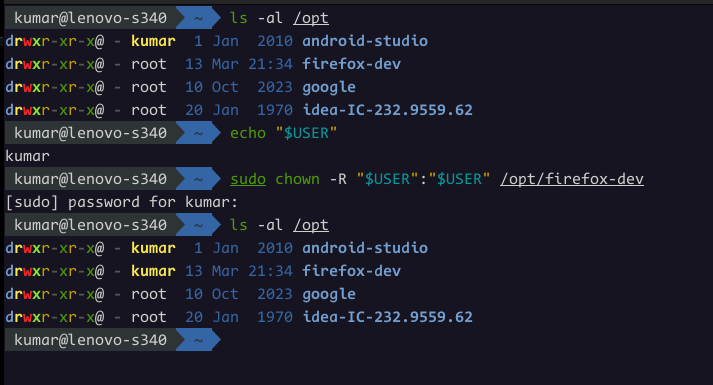

# Firefox 

- [Firefox Extensions](https://addons.mozilla.org/en-US/firefox/extensions/)
- [Firefox Keyboard Shortcuts](https://support.mozilla.org/en-US/kb/keyboard-shortcuts-perform-firefox-tasks-quickly)

## Extensions List:

- [**uBlock Origin**](https://addons.mozilla.org/en-US/firefox/addon/ublock-origin/)
- [**Dark Reader**](https://addons.mozilla.org/en-US/firefox/addon/darkreader/)
- [**Bitwarden**](https://addons.mozilla.org/en-US/firefox/addon/bitwarden-password-manager/)
- Managing Tabs: [**Simple Tab Groups**](https://addons.mozilla.org/en-US/firefox/addon/simple-tab-groups/) / [**Tree-Style Tabs**](https://addons.mozilla.org/en-US/firefox/addon/tree-style-tab/) / [**OneTab**](https://addons.mozilla.org/en-US/firefox/addon/onetab/)
- [**Tabliss**](https://addons.mozilla.org/en-US/firefox/addon/tabliss/) : [Linux_Config](./Tabliss/tabliss_linux.json) , [Windows_Config](./Tabliss/tabliss_windows.json)
- [**WhatFont**](https://addons.mozilla.org/en-US/firefox/addon/zjm-whatfont/)

## Firefox Developer Edition 

1. Download Tarball from [their site](https://www.mozilla.org/en-US/firefox/developer/)

1. Extract contents into `/opt/` and rename folder to `firefox-dev`

   ```sh
   sudo tar xjf firefox-*.tar.bz2 -C /opt
   mv /opt/firefox /opt/firefox-dev
   ```

1. Add Desktop entry `~/.local/share/applications/firefox-dev.desktop` as:

   ```txt
   [Desktop Entry]
   Name=Firefox Developer
   GenericName=Firefox Developer Edition
   Comment=Firefox Developer Edition Web Browser.
   Exec=/opt/firefox-dev/firefox %u
   Type=Application
   Terminal=false
   Icon=/opt/firefox-dev/browser/chrome/icons/default/default128.png
   Categories=Application;Network;X-Developer;
   StartupWMClass=firefox-aurora
   ```

   Allow the desktop application to execute

   ```sh
   chmod +x ~/.local/share/applications/firefox_dev.desktop
   ```

1. To enable automatic updates, change owner of `/opt/firefoc-dev`. Refer [this](https://dev.to/pikapool/firefox-dev-edition-could-not-update-automatically-issue-when-manually-installed-in-linux-fedora-solved-3ia1) post

   
